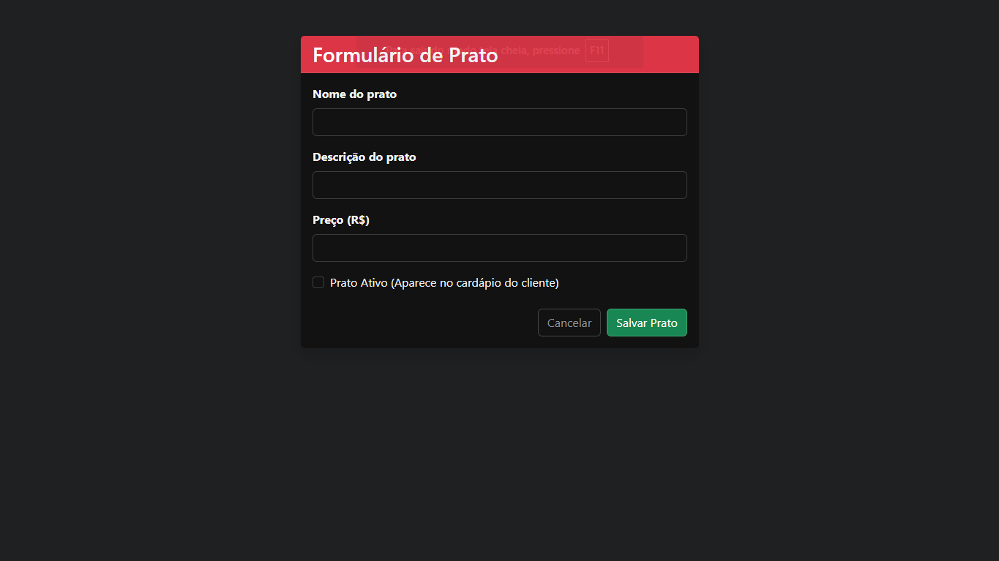
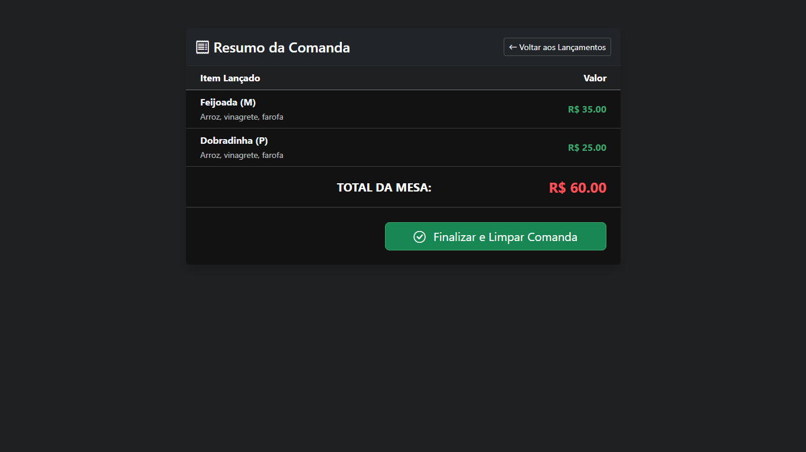
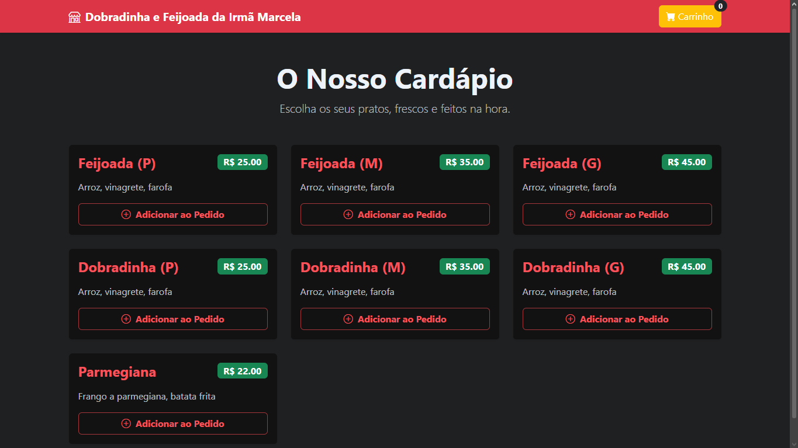
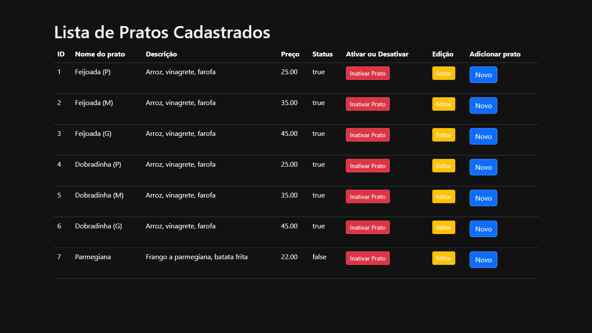

# 🍽️ PDV Restaurante Web

Um sistema de **Ponto de Venda (PDV)** e **Cardápio Digital** desenvolvido com **Java Spring Boot**.

O projeto simula a operação de um restaurante real, oferecendo:

- uma **área administrativa** para gestão de produtos

---

# 🌐 Live Demo (Deploy na Nuvem)

O projeto está hospedado gratuitamente no **Render** utilizando **contentores Docker**.

Sinta-se à vontade para testar:

- 🛒 **[Formulario para criar um prato novo](https://pdv-restaurante.onrender.com/admin/produtos/novo)**
- 👨‍🍳 **[Cardápio Pratos que estão ativos](https://pdv-restaurante.onrender.com/admin/cardapio/comidas)**
- 📜 **[Lista com todos os pratos](https://pdv-restaurante.onrender.com/admin/produtos/lista)**

⚠️ **Aviso de Infraestrutura**

Devido ao **free tier do Render**, a aplicação entra em **hibernação após 15 minutos de inatividade**.

O **primeiro acesso pode levar entre 50 a 60 segundos** para carregar.

Os acessos subsequentes serão **instantâneos**.

---

# 🛠️ Tecnologias e Arquitetura

Este projeto foi construído seguindo o padrão **MVC (Model-View-Controller)**, garantindo **separação de responsabilidades** e facilitando a manutenção.

---

## Backend

- **Java 21 LTS** – Linguagem principal
- **Spring Boot 3.4.x** – Framework base
    - Spring Web
    - Spring Data JPA
    - Spring Validation
- **H2 Database** – Banco de dados relacional em memória
- **Lombok** – Redução de código boilerplate

---

## Frontend

- **Thymeleaf** – Motor de templates para **Server-Side Rendering (SSR)**
- **Bootstrap 5** – Layout responsivo
- **Bootstrap Icons** – Ícones
- **HTML5 / CSS3** – Estrutura e estilização

---

## 🗺️ Mapa de Rotas (Endpoints)

| Endpoint | Método | Descrição | Acesso |
|----------|--------|-----------|----|
| `/` | 🟢 **GET** | Redireciona para o cardápio principal | 🌍 Público |
| `/admin/cardapio/comidas` | 🟢 **GET** | Exibe a vitrine com pratos ativos | 🔐 Admin |
| `/admin/cardapio/adicionar/{id}` | 🟢 **GET** | Adiciona um prato específico ao carrinho | 🔐 Admin |
| `/admin/cardapio/resumo` | 🟢 **GET** | Exibe os itens da comanda e o total a pagar | 🔐 Admin |
| `/admin/cardapio/finalizar` | 🟢 **GET** | Limpa a sessão do carrinho e finaliza o pedido | 🔐 Admin |
| `/admin/produtos/lista` | 🟢 **GET** | Tabela de gestão de todos os produtos cadastrados | 🔐 Admin |
| `/admin/produtos/novo` | 🟢 **GET** | Exibe o formulário de cadastro de novo prato | 🔐 Admin |
| `/admin/produtos/salvar` | 🔵 **POST** | Processa os dados do formulário e salva na base de dados | 🔐 Admin |

🟢 GET → leitura de dados  
🔵 POST → criação/envio de dados

🌍 Público → qualquer usuário   
🔐 Admin → área administrativa
⚠️ OBS -> eu deixei todos "/admin" pois é algo que só vai ser usado por um funcionário. No momento isso aqui é um MVP, ainda quero melhorar bem mais

## DevOps

- **Docker** – Multi-stage build para imagens leves (Alpine)
- **Render** – Continuous Deployment integrado ao GitHub

---

# ✨ Funcionalidades

## 🔐 Módulo Administrativo (ProdutoController)

- [x] **CRUD de Produtos**  
  Cadastro, leitura e edição de pratos.

- [x] **Soft Delete (Inativação)**  
  Produtos não são excluídos da base de dados, apenas marcados como **inativos (`status = false`)**, protegendo o histórico de vendas.

# 🌅 Imagens

